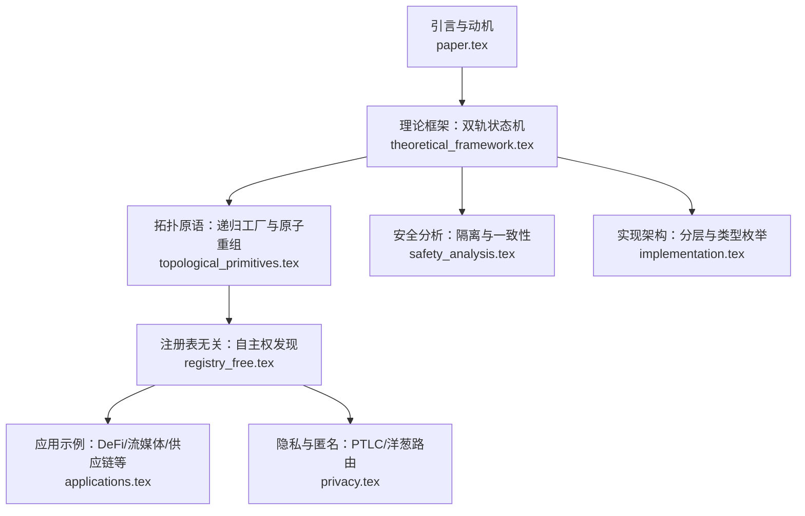
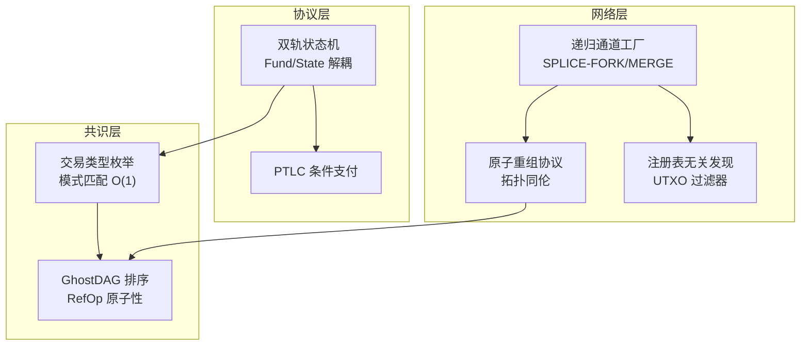
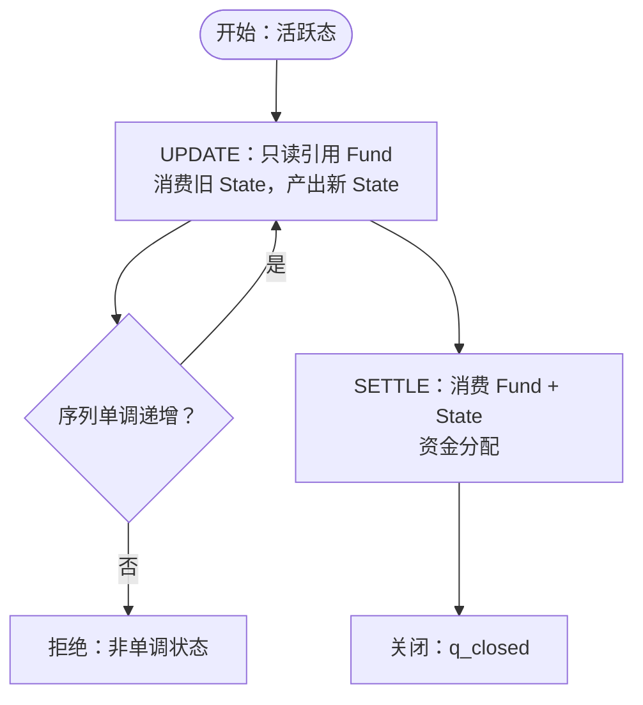
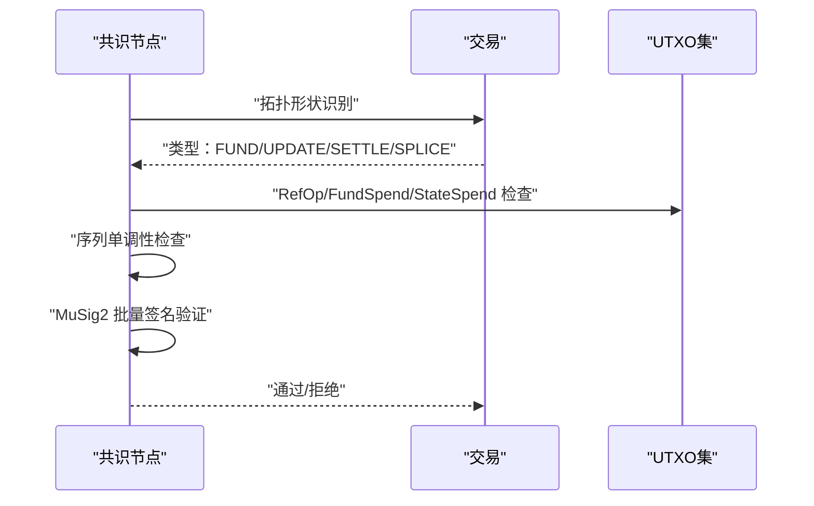
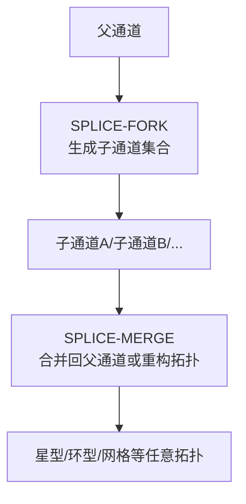
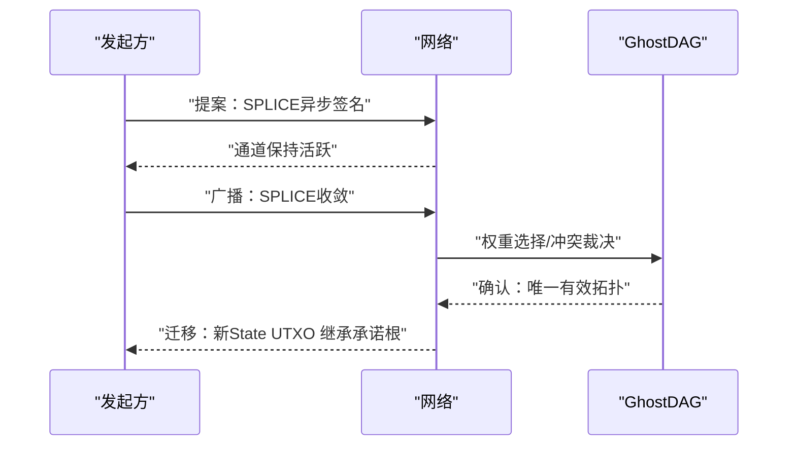
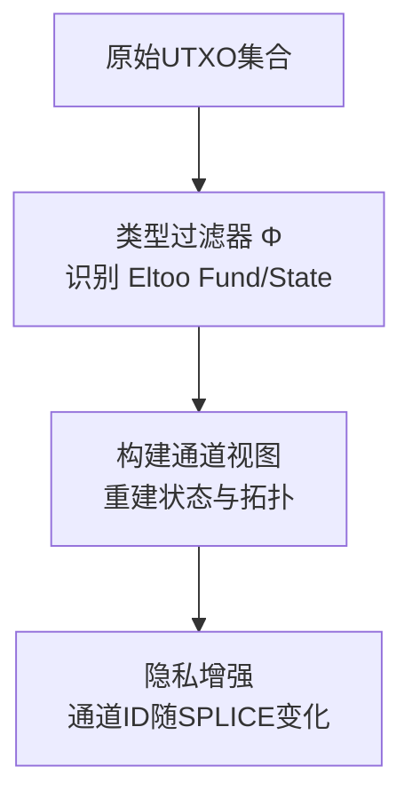
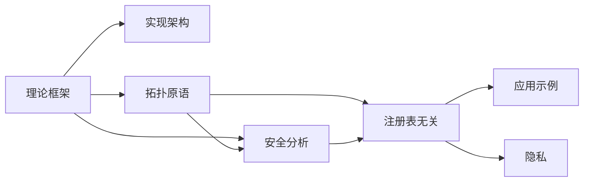

# 关键特性

<cite>
**本文引用的文件**
- [paper.tex](file://paper.tex)
- [contributions.tex](file://sections/contributions.tex)
- [theoretical_framework.tex](file://sections/theoretical_framework.tex)
- [topological_primitives.tex](file://sections/topological_primitives.tex)
- [registry_free.tex](file://sections/registry_free.tex)
- [implementation.tex](file://sections/implementation.tex)
- [applications.tex](file://sections/applications.tex)
- [safety_analysis.tex](file://sections/safety_analysis.tex)
- [privacy.tex](file://sections/privacy.tex)
</cite>

## 目录
1. [引言](#引言)
2. [项目结构](#项目结构)
3. [核心组件](#核心组件)
4. [架构总览](#架构总览)
5. [详细组件分析](#详细组件分析)
6. [依赖关系分析](#依赖关系分析)
7. [性能考量](#性能考量)
8. [故障排查指南](#故障排查指南)
9. [结论](#结论)
10. [附录](#附录)

## 引言
本文件系统性梳理并阐释本研究提出的五大核心特性：双轨状态机、O(1)共识验证、递归通道工厂、原子重组协议与注册表无关架构。我们将从设计动机、实现机制与技术优势三个维度展开，并结合论文中的定理、图示与算法片段路径，给出实际应用场景的工作流程示例，说明这些特性如何协同解决现有支付通道方案的局限性，从而提升系统的可扩展性与隐私性。

## 项目结构
论文采用章节化的组织方式，围绕“理论框架—拓扑原语—安全分析—注册表无关—实现架构—应用示例—隐私—结论”逐步展开。五大核心特性分别在不同章节中得到形式化定义、证明与工程映射。

图表来源
- [paper.tex](file://paper.tex#L140-L220)
- [theoretical_framework.tex](file://sections/theoretical_framework.tex#L1-L120)
- [topological_primitives.tex](file://sections/topological_primitives.tex#L1-L60)
- [safety_analysis.tex](file://sections/safety_analysis.tex#L1-L40)
- [implementation.tex](file://sections/implementation.tex#L1-L40)
- [registry_free.tex](file://sections/registry_free.tex#L1-L40)
- [applications.tex](file://sections/applications.tex#L1-L40)
- [privacy.tex](file://sections/privacy.tex#L1-L40)

章节来源
- [paper.tex](file://paper.tex#L140-L220)

## 核心组件
- 双轨状态机：将资金锚定（Fund UTXO）与状态指针（State UTXO）解耦，实现静态价值层与动态状态层的正交分离。
- O(1)共识验证：通过共识层原生交易类型枚举与模式匹配，将验证复杂度从脚本解释降为常数级。
- 递归通道工厂：以单次原子切分/合并操作实现任意拓扑的同伦变换，支撑分形网络与任意嵌套深度。
- 原子重组协议：基于拓扑同伦与GhostDAG权重选择，消除流动性碎片化，确保价值守恒与线性收敛。
- 注册表无关架构：以UTXO集合为单一事实来源，通过类型过滤器完成通道发现与重建，无需外部注册中心。

章节来源
- [contributions.tex](file://sections/contributions.tex#L1-L40)
- [theoretical_framework.tex](file://sections/theoretical_framework.tex#L160-L220)
- [topological_primitives.tex](file://sections/topological_primitives.tex#L1-L40)
- [registry_free.tex](file://sections/registry_free.tex#L1-L40)

## 架构总览
下图展示了五大特性在系统中的位置与交互：双轨状态机提供语义基础，O(1)共识验证保障执行效率，递归工厂与原子重组支撑复杂拓扑，注册表无关架构打通发现与隐私。

图表来源
- [theoretical_framework.tex](file://sections/theoretical_framework.tex#L280-L360)
- [topological_primitives.tex](file://sections/topological_primitives.tex#L160-L220)
- [registry_free.tex](file://sections/registry_free.tex#L1-L60)

## 详细组件分析

### 双轨状态机：分离价值与状态，实现零链上成本的状态更新
- 设计动机
  - 将资金托管与状态版本合并在单个UTXO会导致每次状态更新都需“移动”资金，造成O(n)链上足迹与高开销。
  - 通过双轨模型将静态资金锚定与动态状态指针解耦，使状态更新不消耗Fund UTXO，仅变更State UTXO。
- 实现机制
  - Fund UTXO：携带资金总量、参与者聚合密钥、通道标识等不变元数据。
  - State UTXO：携带序列号、余额承诺根、PTLC承诺根等高频变化信息。
  - RefOp：只读引用Fund UTXO，不消耗其存在，用于状态验证与绑定。
- 技术优势
  - 零链上成本的状态迭代（UPDATE），仅在SETTLE或SPLICE时消费Fund UTXO。
  - 单一事实来源：通道身份由Fund UTXO唯一确定，State UTXO随时间演进。
- 应用场景示例
  - 微支付流：每秒多次UPDATE，最终一次性SETTLE，显著降低链上费用与延迟。
  - 供应链金融：多层级通道通过递归工厂拆分，子通道独立结算，父通道不受影响。

图表来源
- [theoretical_framework.tex](file://sections/theoretical_framework.tex#L560-L620)

章节来源
- [theoretical_framework.tex](file://sections/theoretical_framework.tex#L160-L220)
- [theoretical_framework.tex](file://sections/theoretical_framework.tex#L220-L320)
- [theoretical_framework.tex](file://sections/theoretical_framework.tex#L560-L620)

### O(1)共识验证：原生类型枚举与模式匹配
- 设计动机
  - 脚本解释带来O(script_size)的验证开销，限制吞吐与安全性。
  - 将通道语义内嵌到共识层，以输入/输出拓扑形状决定交易类型，实现O(1)分类与校验。
- 实现机制
  - 交易类型枚举：FUND、UPDATE、SETTLE、SPLICE，依据RefOp/Spend拓扑判定。
  - 签名聚合：MuSig2批量验证，摊销复杂度。
  - 单点检查：序列单调性、RefOp存在性、签名有效性。
- 技术优势
  - 验证复杂度从O(script)降至O(1)，全节点可在秒级处理数千笔Eltoo交易。
  - 类型系统编译期保证，避免未定义状态与无效转换。
- 应用场景示例
  - 高频DeFi交换：PTLC验证O(1)，跨资产原子交换低延迟。
  - 大规模微支付：每秒数千笔UPDATE，链上确认成本可控。

图表来源
- [theoretical_framework.tex](file://sections/theoretical_framework.tex#L280-L360)
- [theoretical_framework.tex](file://sections/theoretical_framework.tex#L360-L420)
- [implementation.tex](file://sections/implementation.tex#L70-L120)

章节来源
- [theoretical_framework.tex](file://sections/theoretical_framework.tex#L280-L360)
- [implementation.tex](file://sections/implementation.tex#L70-L120)

### 递归通道工厂：分形拓扑与任意嵌套深度
- 设计动机
  - 线性拓扑导致资本利用率低、管理复杂；需要支持树状/网格等复杂拓扑。
  - 通过SPLICE操作实现通道分裂与合并，形成自相似k叉树，保持容量守恒。
- 实现机制
  - SPLICE-FORK：将父通道拆分为多个子通道，子通道生命周期与父通道解耦。
  - SPLICE-MERGE：将多个子通道合并回父通道，或在星型拓扑间重平衡。
  - 同伦变换：任意拓扑可通过一系列SPLICE原子化转换，保持价值守恒。
- 技术优势
  - 支持任意嵌套深度，协议逻辑在各深度保持一致（标度不变性）。
  - 价值守恒与流动性碎片化最小化，便于大规模网络的动态重配置。
- 应用场景示例
  - DeFi流动性网格：连接多个AMM池，实现跨资产原子交换。
  - 供应链金融：制造商-一级供应商-二级供应商的条件支付链路。

图表来源
- [topological_primitives.tex](file://sections/topological_primitives.tex#L1-L60)
- [topological_primitives.tex](file://sections/topological_primitives.tex#L160-L220)

章节来源
- [topological_primitives.tex](file://sections/topological_primitives.tex#L1-L60)
- [topological_primitives.tex](file://sections/topological_primitives.tex#L160-L220)

### 原子重组协议：拓扑同伦与流动性碎片化最小化
- 设计动机
  - 传统通道维护常需停机或串行化，影响可用性与吞吐。
  - 通过单次SPLICE事务实现拓扑同伦变换，消除碎片化，确保价值守恒。
- 实现机制
  - 同伦映射：G1 ≃ G2，存在SPLICE序列使网络拓扑从G1同伦到G2。
  - GhostDAG权重选择：并发冲突通过子图权重择优，确保唯一有效拓扑。
  - 价值守恒：ΣV_in = ΣV_out + 手续费，避免空造币与资金流失。
- 技术优势
  - 非阻塞切分：异步签名阶段通道仍可继续更新，收敛后原子迁移。
  - 流动性最优分配：通过重平衡策略最小化碎片化，提升网络吞吐。
- 应用场景示例
  - 借贷清算：对100个用户进行原子化清算，避免部分失败与滑点风险。
  - CDN激励：根据性能自动重平衡，优先高可用路径。

图表来源
- [topological_primitives.tex](file://sections/topological_primitives.tex#L168-L220)
- [safety_analysis.tex](file://sections/safety_analysis.tex#L152-L199)

章节来源
- [topological_primitives.tex](file://sections/topological_primitives.tex#L168-L220)
- [safety_analysis.tex](file://sections/safety_analysis.tex#L152-L199)

### 注册表无关架构：自主权发现与隐私增强
- 设计动机
  - 中心化注册表带来隐私泄露、可扩展瓶颈与审查风险。
  - 以UTXO集合为单一事实来源，通过类型过滤器完成通道发现与重建。
- 实现机制
  - 自主权发现：Φ_filter(UTXO_Set) → {Fund, State}，单次扫描完成。
  - 通道ID随SPLICE变化，实现临时去标识化，抵抗图分析。
  - PTLC验证O(1)：通过RefOp直接获取Fund元数据，批量曲线运算。
- 技术优势
  - 发现复杂度O(N)，线性可扩展；无需维护全局图。
  - 通道ID与拓扑动态变化，增强隐私与抗审查能力。
- 应用场景示例
  - 去中心化交易所：链上扫描重建通道视图，无需外部注册。
  - 游戏经济：玩家与服务器之间建立通道，资产即时转移，仅在必要时结算。

图表来源
- [registry_free.tex](file://sections/registry_free.tex#L1-L60)
- [registry_free.tex](file://sections/registry_free.tex#L100-L170)

章节来源
- [registry_free.tex](file://sections/registry_free.tex#L1-L60)
- [registry_free.tex](file://sections/registry_free.tex#L100-L170)

## 依赖关系分析
- 组件耦合
  - 双轨状态机与共识层紧密耦合：UPDATE/SETTLE/SPLICE的输入/输出拓扑直接驱动共识规则。
  - 递归工厂与原子重组依赖GhostDAG排序与RefOp原子性，确保并发安全与拓扑收敛。
  - 注册表无关架构依赖类型过滤器与UTXO索引，支撑高效发现与重建。
- 外部依赖
  - 密码学：MuSig2聚合签名、ECC上的PTLC、域分离标签防止跨协议重放。
  - 共识：GhostDAG提供部分有序与权重择优，DAA时间戳用于超时控制。
- 潜在循环依赖
  - 通过分层架构避免：共识层不依赖应用层，应用层仅消费共识层提供的通道视图。

图表来源
- [implementation.tex](file://sections/implementation.tex#L1-L40)
- [topological_primitives.tex](file://sections/topological_primitives.tex#L1-L40)
- [safety_analysis.tex](file://sections/safety_analysis.tex#L1-L40)
- [registry_free.tex](file://sections/registry_free.tex#L1-L40)
- [applications.tex](file://sections/applications.tex#L1-L40)
- [privacy.tex](file://sections/privacy.tex#L1-L40)

章节来源
- [implementation.tex](file://sections/implementation.tex#L1-L40)
- [topological_primitives.tex](file://sections/topological_primitives.tex#L1-L40)
- [safety_analysis.tex](file://sections/safety_analysis.tex#L1-L40)
- [registry_free.tex](file://sections/registry_free.tex#L1-L40)
- [applications.tex](file://sections/applications.tex#L1-L40)
- [privacy.tex](file://sections/privacy.tex#L1-L40)

## 性能考量
- 验证复杂度
  - 交易类型识别：O(1)（拓扑形状）
  - 状态单调性：O(1)（整数比较）
  - 签名验证：O(1)摊销（MuSig2批量）
  - UTXO查找：O(log N)（不可避免）
  - 总体：Eltoo特定验证为O(1)，含UTXO查找为O(log N)
- 吞吐能力
  - 测试网实测：UPDATE约0.08ms，SETTLE约0.35ms，SPLICE约0.28ms
  - 全节点可在1秒内验证含10000+交易的区块
- 并发与冲突
  - GhostDAG并发块数量与参数k决定收敛速度；Active State Lease与DAG排序规则确保冲突消解

章节来源
- [theoretical_framework.tex](file://sections/theoretical_framework.tex#L360-L420)
- [theoretical_framework.tex](file://sections/theoretical_framework.tex#L398-L460)

## 故障排查指南
- 常见问题
  - 非单调状态：UPDATE后序列未严格递增，被共识拒绝
  - RefOp缺失：引用Fund UTXO不存在或已被消费
  - SPLICE冲突：并发Splice通过GhostDAG权重择优，仅保留一个有效
  - PTLC验证失败：椭圆曲线运算不满足锁定关系
- 定位方法
  - 检查交易输入/输出拓扑是否符合FUND/UPDATE/SETTLE/SPLICE
  - 核对State UTXO序列单调性与RefOp绑定的Fund OutPoint
  - 使用UTXO索引快速定位Fund/State配对
  - 对照SPLICE拓扑约束与价值守恒
- 预防措施
  - STPC策略限制mempool熵，降低DoS攻击成本
  - 域分离标签防止跨协议重放
  - DAA时间戳与CSV超时保障挑战期与离线容忍

章节来源
- [safety_analysis.tex](file://sections/safety_analysis.tex#L32-L104)
- [implementation.tex](file://sections/implementation.tex#L150-L200)
- [registry_free.tex](file://sections/registry_free.tex#L100-L170)

## 结论
五大特性共同构成Native Eltoo的系统性解决方案：
- 双轨状态机消除状态更新的链上成本与历史依赖；
- O(1)共识验证将验证复杂度降至常数级；
- 递归通道工厂与原子重组协议支撑任意拓扑的同伦变换与价值守恒；
- 注册表无关架构打通发现、隐私与抗审查；
- 在DeFi、微支付、游戏经济、物联网等场景中，显著提升可扩展性与隐私性。

[无章节来源：总结性内容]

## 附录
- 工作流示例（代码片段路径）
  - 双轨状态机：[状态机定义与过渡规则](file://sections/theoretical_framework.tex#L1-L120)
  - O(1)共识验证：[交易类型枚举与验证管线](file://sections/implementation.tex#L70-L120)
  - 递归通道工厂：[SPLICE拓扑变换与价值守恒](file://sections/topological_primitives.tex#L160-L220)
  - 原子重组协议：[拓扑同伦与GhostDAG权重选择](file://sections/safety_analysis.tex#L152-L199)
  - 注册表无关架构：[UTXO过滤器与通道发现](file://sections/registry_free.tex#L1-L60)

[无章节来源：附录为参考路径汇总]