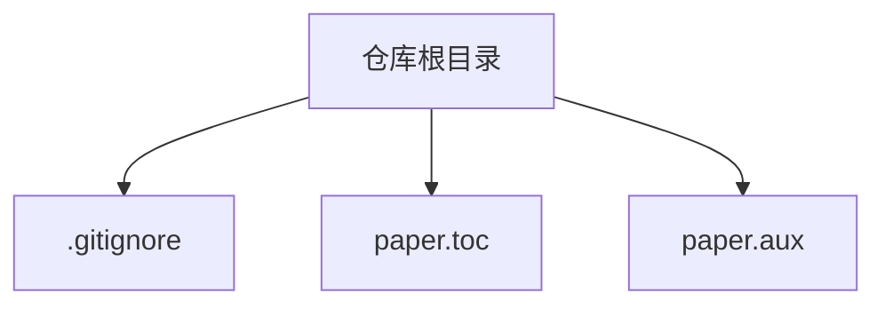
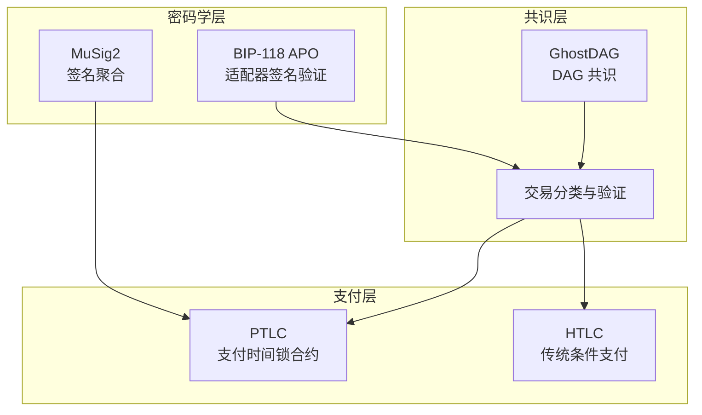
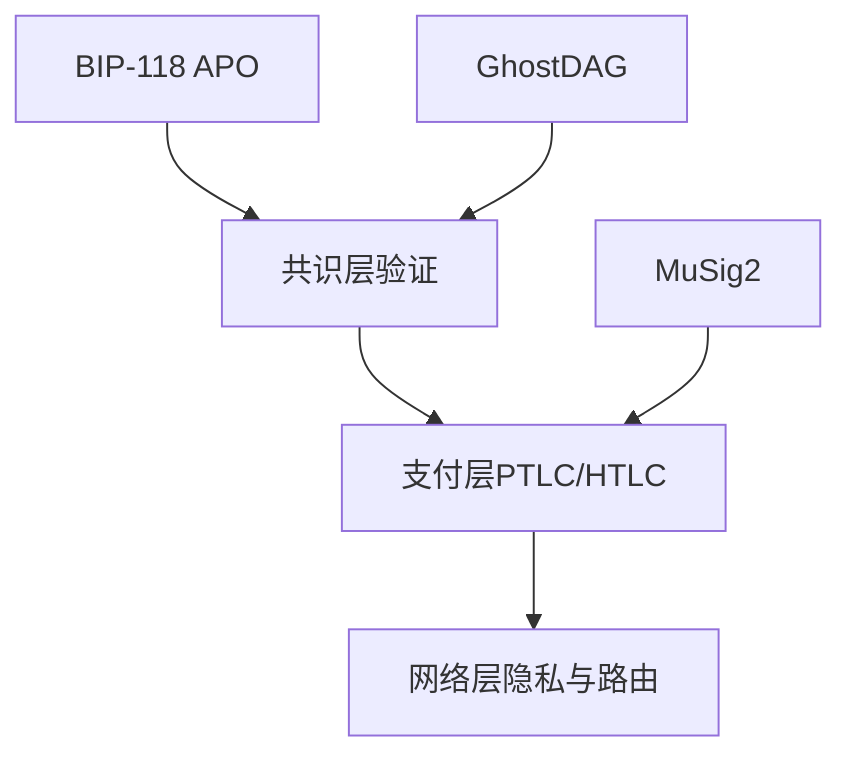

# 外部依赖

<cite>
**本文引用的文件**
- [paper.toc](file://paper.toc)
- [paper.aux](file://paper.aux)
- [.gitignore](file://.gitignore)
</cite>

## 目录
1. [引言](#引言)
2. [项目结构](#项目结构)
3. [核心组件](#核心组件)
4. [架构总览](#架构总览)
5. [详细组件分析](#详细组件分析)
6. [依赖关系分析](#依赖关系分析)
7. [性能考量](#性能考量)
8. [故障排查指南](#故障排查指南)
9. [结论](#结论)
10. [附录](#附录)

## 引言
本文件聚焦于本研究方案中所依赖的外部技术标准与协议，包括：
- BIP-118（适配器签名验证）
- GhostDAG（有向无环图共识）
- MuSig2（签名聚合方案）
- PTLC（支付时间锁合约）

我们将从技术背景、在系统中的作用、版本兼容性建议以及官方文档链接等方面进行说明，并给出开发者如何正确集成这些外部组件以复现或扩展本研究方案的实践指导。

## 项目结构
当前仓库仅包含论文索引文件与忽略配置，未包含源代码实现。因此，本文件基于论文目录与辅助文件中的条目，对上述外部依赖进行系统化梳理与说明。

图表来源
- [paper.toc](file://paper.toc#L1-L175)
- [paper.aux](file://paper.aux#L1-L405)
- [.gitignore](file://.gitignore#L1-L11)

章节来源
- [paper.toc](file://paper.toc#L1-L175)
- [paper.aux](file://paper.aux#L1-L405)
- [.gitignore](file://.gitignore#L1-L11)

## 核心组件
本节概述四个外部依赖在本研究方案中的定位与职责：
- BIP-118：通过适配器签名（APO）实现对签名验证的工程化约束，强调“密钥派生路径正确性”的信任假设，共识层可正确验证签名，但工程层面仍需避免上下文混淆导致的重放攻击。
- GhostDAG：作为 DAG 共识兼容性基础，支撑交易拓扑与确认参数设计，确保并发拼接等操作在权重规则下得到一致排序与冲突解决。
- MuSig2：用于多签通道的安全性增强，通过签名聚合降低通信复杂度与签名体积，提升链上与跨节点交互效率。
- PTLC：作为 HTLC 的隐私增强替代，通过同态加法在每跳盲化锁定点，显著提升多跳支付的隐私保护能力。

章节来源
- [paper.toc](file://paper.toc#L1-L175)
- [paper.aux](file://paper.aux#L1-L405)

## 架构总览
下图展示四个外部依赖在整体架构中的角色与相互关系（概念示意）：

说明
- 共识层负责确定交易拓扑与确认顺序，为支付层提供确定性的时序与原子性保障。
- 支付层在交易验证通过后执行条件支付逻辑；PTLC相较 HTLC 提供更强隐私。
- 密码学层为支付与共识提供安全基元：MuSig2 优化多签交互，APO 约束签名验证的工程边界。

## 详细组件分析

### BIP-118（适配器签名验证）
- 技术要点
  - 使用适配器签名（APO）在共识层进行签名验证，强调“密钥派生路径正确性”的信任假设。
  - 工程缺口：标准与 APO 上下文混用可能导致密钥重用与重放攻击，尽管协议逻辑正确。
- 在系统中的作用
  - 作为签名验证的外部标准，确保共识层对签名的正确性判定。
  - 对钱包实现提出工程约束，避免上下文混淆引发的安全问题。
- 版本兼容性建议
  - 遵循 BIP-118 规范的适配器签名流程与域分隔要求。
  - 在多上下文场景（如标准与 APO）中严格分离密钥派生路径，防止重放。
- 官方文档与参考
  - 参考条目：[bip118]（见论文辅助文件中的参考文献条目）
  - 建议查阅 BIP-118 官方规范与实现示例，确保与共识层验证逻辑一致。

章节来源
- [paper.aux](file://paper.aux#L16-L23)
- [paper.aux](file://paper.aux#L1-L405)

### GhostDAG（有向无环图共识）
- 技术要点
  - DAG 共识用于处理并发交易与权重排序，支撑交易拓扑与确认参数设计。
  - 并发拼接等操作可通过权重规则进行冲突解决与一致性保证。
- 在系统中的作用
  - 为交易类型枚举与验证提供拓扑基础，确保 Ref-UTXO 的原子性与顺序性。
  - 影响确认深度与安全性边界，决定交易最终性与回滚风险。
- 版本兼容性建议
  - 采用与 GhostDAG 兼容的权重规则与确认参数，确保与论文中“确认参数”、“安全深度”一致。
  - 在实现中明确区分“消费边”与“非消费引用”，以匹配论文中的拓扑流描述。
- 官方文档与参考
  - 参考条目：[sompolinsky2015ghostdag], [kaspa2021]（见论文辅助文件中的参考文献条目）
  - 建议结合 GhostDAG 论文与实现，校准确认参数与冲突解决策略。

章节来源
- [paper.aux](file://paper.aux#L34-L40)
- [paper.aux](file://paper.aux#L82-L90)
- [paper.aux](file://paper.aux#L110-L115)
- [paper.toc](file://paper.toc#L1-L175)

### MuSig2（签名聚合方案）
- 技术要点
  - 通过 Schnorr 签名聚合减少多签签名体积与通信轮次，提升链上与跨节点交互效率。
  - 在论文中被列为“多签通道的安全性增强”手段。
- 在系统中的作用
  - 优化多签通道的签名阶段，降低通信复杂度与验证开销。
  - 与交易类型枚举、验证流水线协同，支撑 O(1) 的分类与验证性能目标。
- 版本兼容性建议
  - 遵循 MuSig2 规范的聚合流程与域分隔要求，确保与共识层验证一致。
  - 在实现中明确“PSTT 环包”与“域分隔”的使用，避免跨用途混淆。
- 官方文档与参考
  - 参考条目：[maxwell2018musig], [nick2021musig2]（见论文辅助文件中的参考文献条目）
  - 建议参考 MuSig2 官方规范与实现示例，确保聚合签名的正确性与安全性。

章节来源
- [paper.aux](file://paper.aux#L226-L235)
- [paper.aux](file://paper.aux#L227-L233)
- [paper.toc](file://paper.toc#L80-L95)

### PTLC（支付时间锁合约）
- 技术要点
  - PTLC 通过同态加法在每跳对锁定点进行盲化，相较 HTLC 更强隐私。
  - 论文中提供了 PTLC 声明验证逻辑与常数时间验证实现思路。
- 在系统中的作用
  - 替代 HTLC 实现多跳原子支付，提升隐私保护能力。
  - 与共识层的交易分类与验证机制配合，确保声明验证的 O(1) 复杂度。
- 版本兼容性建议
  - 遵循 PTLC 的同态加法与盲化原则，确保每跳独立验证且不泄露全局哈希。
  - 在实现中明确“常数时间验证逻辑”的边界，避免侧信道泄漏。
- 官方文档与参考
  - 参考条目：[malavolta2019adaptor]（见论文辅助文件中的参考文献条目）
  - 建议参考 PTLC 相关论文与实现，理解其与 HTLC 的差异与优势。

章节来源
- [paper.aux](file://paper.aux#L90-L110)
- [paper.aux](file://paper.aux#L162-L170)
- [paper.aux](file://paper.aux#L195-L205)
- [paper.toc](file://paper.toc#L1-L175)

## 依赖关系分析
下图展示四个外部依赖之间的协作关系与在系统中的位置映射（概念示意）：

说明
- 共识层依赖 GhostDAG 提供的拓扑与确认参数，同时执行 BIP-118 APO 的签名验证。
- 支付层在共识层之上实现 PTLC/HTLC 的条件支付，MuSig2 优化多签交互。
- 网络层关注隐私与路由（如洋葱路由），与支付层共同提升整体隐私能力。

## 性能考量
- 交易验证性能
  - 论文指出通过原生类型枚举与共识层嵌入验证机制，可消除脚本虚拟机开销，实现约数倍的验证延迟降低。
  - PTLC 的常数时间验证逻辑有助于在多跳场景中保持稳定的验证复杂度。
- 通信复杂度
  - MuSig2 聚合签名可显著降低多签交互的通信轮次与数据量，适合高并发通道网络。
- 存储与发现
  - 论文提供了存储成本与发现机制的对比分析，可作为实现规模化的参考。

章节来源
- [paper.aux](file://paper.aux#L288-L315)
- [paper.aux](file://paper.aux#L195-L205)
- [paper.aux](file://paper.aux#L226-L235)

## 故障排查指南
- BIP-118 工程缺口
  - 症状：在标准与 APO 上下文混用时出现重放攻击。
  - 排查要点：检查密钥派生路径是否严格分离，避免跨上下文重用。
- PTLC 隐私泄露
  - 症状：多跳支付暴露全局哈希，隐私不足。
  - 排查要点：确认每跳盲化是否使用同态加法，避免泄露全局哈希。
- GhostDAG 冲突与确认
  - 症状：并发拼接导致冲突或确认延迟。
  - 排查要点：核对权重规则与确认参数，确保与论文中的“确认参数”、“安全深度”一致。
- MuSig2 聚合错误
  - 症状：聚合签名验证失败或跨用途混淆。
  - 排查要点：检查域分隔与 PSTT 环包使用，确保与共识层验证一致。

章节来源
- [paper.aux](file://paper.aux#L16-L23)
- [paper.aux](file://paper.aux#L90-L110)
- [paper.aux](file://paper.aux#L110-L115)
- [paper.aux](file://paper.aux#L226-L235)

## 结论
本研究方案将 BIP-118、GhostDAG、MuSig2 与 PTLC 四个外部依赖有机整合：BIP-118 约束签名验证的工程边界，GhostDAG 提供 DAG 共识与确认参数，MuSig2 优化多签交互，PTLC 替代 HTLC 提升隐私。开发者应遵循各标准的规范与参考实现，严格进行域分隔与上下文隔离，以确保在共识层与支付层的正确集成与扩展。

## 附录
- 参考文献条目（来自论文辅助文件）
  - [bip118]
  - [sompolinsky2015ghostdag]
  - [kaspa2021]
  - [maxwell2018musig]
  - [nick2021musig2]
  - [malavolta2019adaptor]

章节来源
- [paper.aux](file://paper.aux#L390-L404)