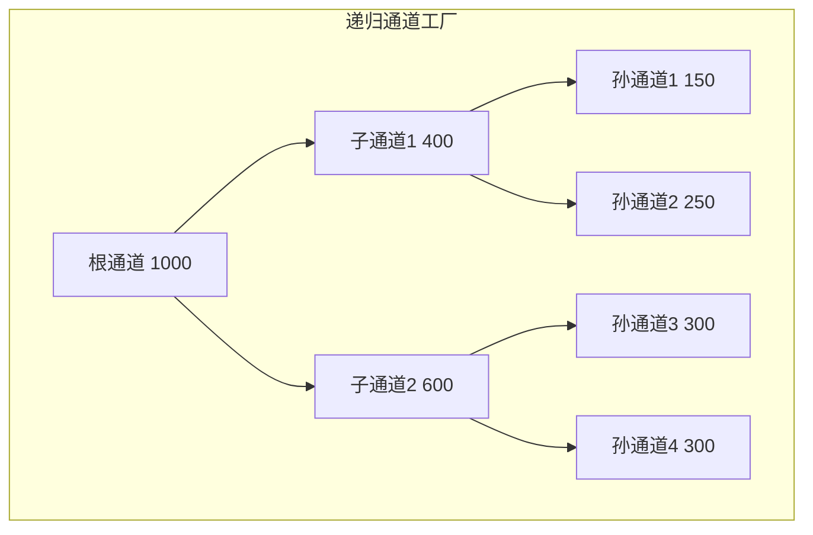
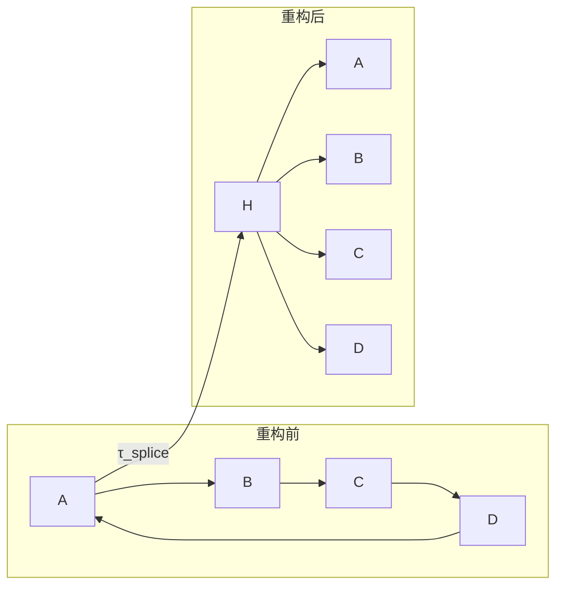

# 应用场景

<cite>
**本文档引用的文件**   
- [paper.tex](file://paper.tex)
- [sections/applications.tex](file://sections/applications.tex)
- [sections/evaluation.tex](file://sections/evaluation.tex)
- [sections/implementation.tex](file://sections/implementation.tex)
- [sections/topological_primitives.tex](file://sections/topological_primitives.tex)
- [sections/theoretical_framework.tex](file://sections/theoretical_framework.tex)
</cite>

## 目录
1. [高频微支付场景](#高频微支付场景)
2. [跨链资产交换与去中心化交易所](#跨链资产交换与去中心化交易所)
3. [递归通道工厂与复杂网络拓扑](#递归通道工厂与复杂网络拓扑)
4. [原子重组协议与流动性管理](#原子重组协议与流动性管理)
5. [性能评估与系统表现](#性能评估与系统表现)

## 高频微支付场景

该支付通道架构在高频微支付场景中展现出巨大潜力，能够支持流媒体支付、物联网设备结算等需要高吞吐量和低延迟的应用。通过将交易处理从链上转移到链下，仅在最终结算时上链，系统显著提升了吞吐量。

在微支付流媒体场景中，用户与服务提供商建立支付通道，初始状态为 $C_{\mathrm{stream}} = \{U: 100, P: 0\}$。在服务过程中，每秒根据费率进行状态更新（$\Delta = \mathrm{rate}$），实现千次每秒（TPS）级别的链下交易规模。最终结算仅在会话结束时发生，极大地降低了链上交易成本和延迟。

物联网（IoT）微交易场景同样受益于该架构。设备间的自主机器对机器支付（如电动汽车充电、带宽市场）要求毫秒级延迟、亚美分精度和零维护成本。该架构的 $\mathcal{O}(1)$ 状态复杂度和无状态客户端特性，使其成为资源受限IoT设备的理想选择。

**Section sources**
- [sections/applications.tex](file://sections/applications.tex#L57-L101)

## 跨链资产交换与去中心化交易所

该架构为跨链资产交换和去中心化交易所（DEX）提供了高效、安全的解决方案。通过将订单簿置于链下，DEX可以实现亚100毫秒的交易延迟和低于0.01美元的交易成本，相较于链上DEX分别提升了100至600倍和500至5000倍。其吞吐量超过10,000 TPS，且由于链下匹配，完全消除了矿工可提取价值（MEV）风险。

在跨链资产交换中，支付通道网络（PCN）作为桥梁，实现不同区块链资产的原子交换。基于点时间锁合约（PTLC）的机制确保了多跳支付的原子性，即要么所有跳转都成功，要么全部失败，无需信任中介。PTLC利用椭圆曲线离散对数问题（ECDLP）的数学基础，通过同态加法对支付路径进行盲化，使得各跳的锁定点 $Q_i$ 对外部观察者而言是不可关联的，从而保护了支付隐私。

**Section sources**
- [sections/applications.tex](file://sections/applications.tex#L67-L87)
- [sections/theoretical_framework.tex](file://sections/theoretical_framework.tex#L634-L790)

## 递归通道工厂与复杂网络拓扑

递归通道工厂是构建复杂支付网络拓扑的核心原语。它允许从一个父通道“分裂”出多个子通道，形成一个自相似的 $k$-元树结构。该架构的关键优势在于其**流动性守恒**和**尺度不变性**。

**Diagram sources**
- [sections/topological_primitives.tex](file://sections/topological_primitives.tex#L55-L96)

在任何递归深度 $d$，总通道容量保持不变：$\CapOp(C_{\text{root}}) = \sum_{i \in \text{Leaves}(d)} \CapOp(C_i)$。这种尺度不变性保证了协议逻辑在任意树深度下都保持一致，简化了实现和验证。通道工厂使得支付网络能够动态适应需求，例如在DeFi流动性网格中，将多个AMM池连接成一个网状结构，用 $\sqrt{N}$ 个流动性池服务 $N$ 个交易对，极大地提高了资本效率。

**Section sources**
- [sections/topological_primitives.tex](file://sections/topological_primitives.tex#L3-L96)
- [sections/applications.tex](file://sections/applications.tex#L5-L48)

## 原子重组协议与流动性管理

原子重组协议解决了传统通道维护中的“停止世界”（stop-the-world）问题，允许在不中断支付服务的情况下进行拓扑重构。该协议通过单个 $\tau_{\mathrm{splice}}$ 交易，即可原子性地将一种拓扑（如环形）转换为另一种拓扑（如星形）。

**Diagram sources**
- [sections/topological_primitives.tex](file://sections/topological_primitives.tex#L105-L139)

该协议的核心是**非阻塞拼接**。在异步签名阶段，通道仍可进行常规更新，确保了流动性在重构期间的可用性。原子重组还优化了跨通道支付的流动性管理。通过 $\tau_{\mathrm{rebalance}}$ 交易，可以最小化流动性碎片化，将资金重新分配到需求更高的路径上。研究表明，支持原子重组所需的L1吞吐量极低（例如，每秒100笔重组交易仅需0.07 TPS），现代区块链轻松满足此要求。

**Section sources**
- [sections/topological_primitives.tex](file://sections/topological_primitives.tex#L99-L242)

## 性能评估与系统表现

结合论文中的性能评估数据，该系统在不同应用场景下表现出卓越的吞吐量、延迟和资源消耗特性。

在验证性能方面，原生类型枚举实现了 $\mathcal{O}(1)$ 的模式匹配，相比传统脚本解释，验证延迟降低了3至5倍。例如，更新交易的验证延迟从156微秒降至38微秒。

在存储效率上，该架构实现了**无状态**。由于采用单调状态替代，无需存储历史状态和撤销密钥，存储复杂度从 $\mathcal{O}(N)$ 降至 $\mathcal{O}(1)$。对于1000次更新，存储成本从约288KB减少到376B，降低了99.87%。

在结算延迟方面，得益于GhostDAG共识，系统实现了亚秒级的最终确定性。在 $k=16$ 的参数下，达到 $10^{-6}$ 安全性的中位时间约为1.7秒，而比特币需要约60分钟，确认速度提升了1200倍。

综上所述，该支付通道架构通过双轨状态机、递归通道工厂和原子重组协议，为高频微支付、跨链交换和复杂DeFi应用提供了可扩展、高效且安全的基础设施。

**Section sources**
- [sections/evaluation.tex](file://sections/evaluation.tex#L1-L178)
- [sections/theoretical_framework.tex](file://sections/theoretical_framework.tex#L867-L945)