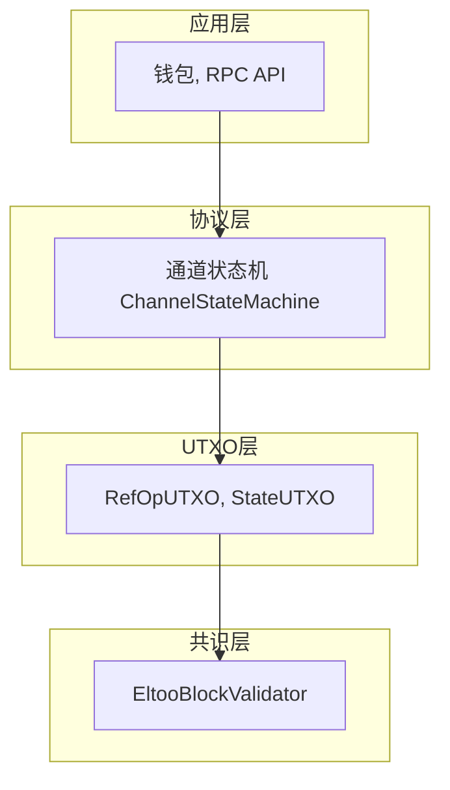
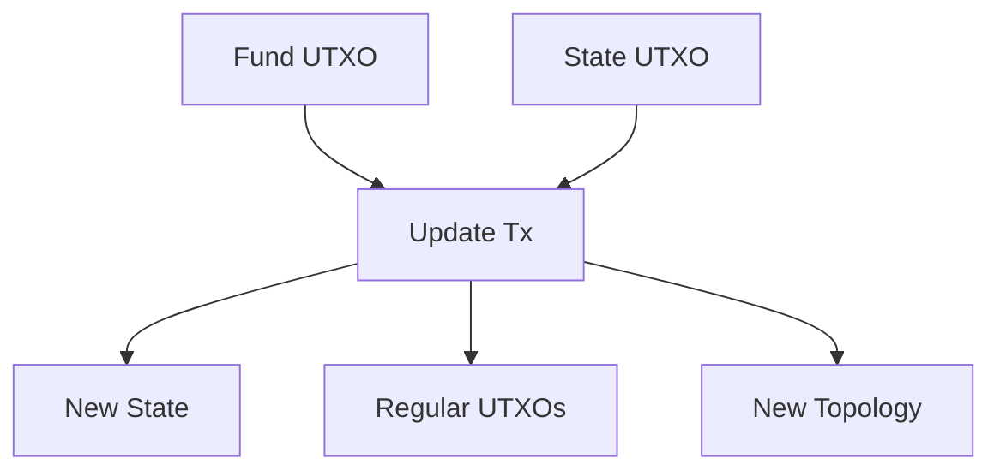
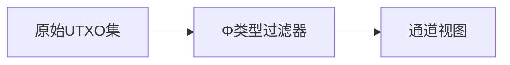
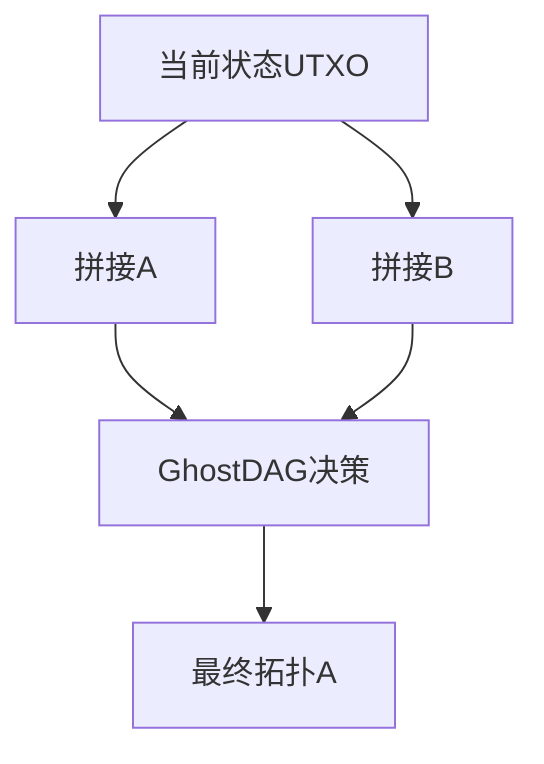
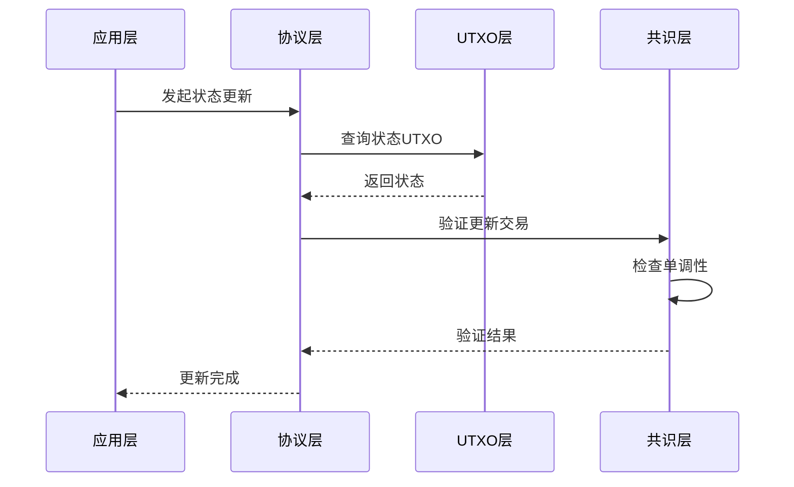
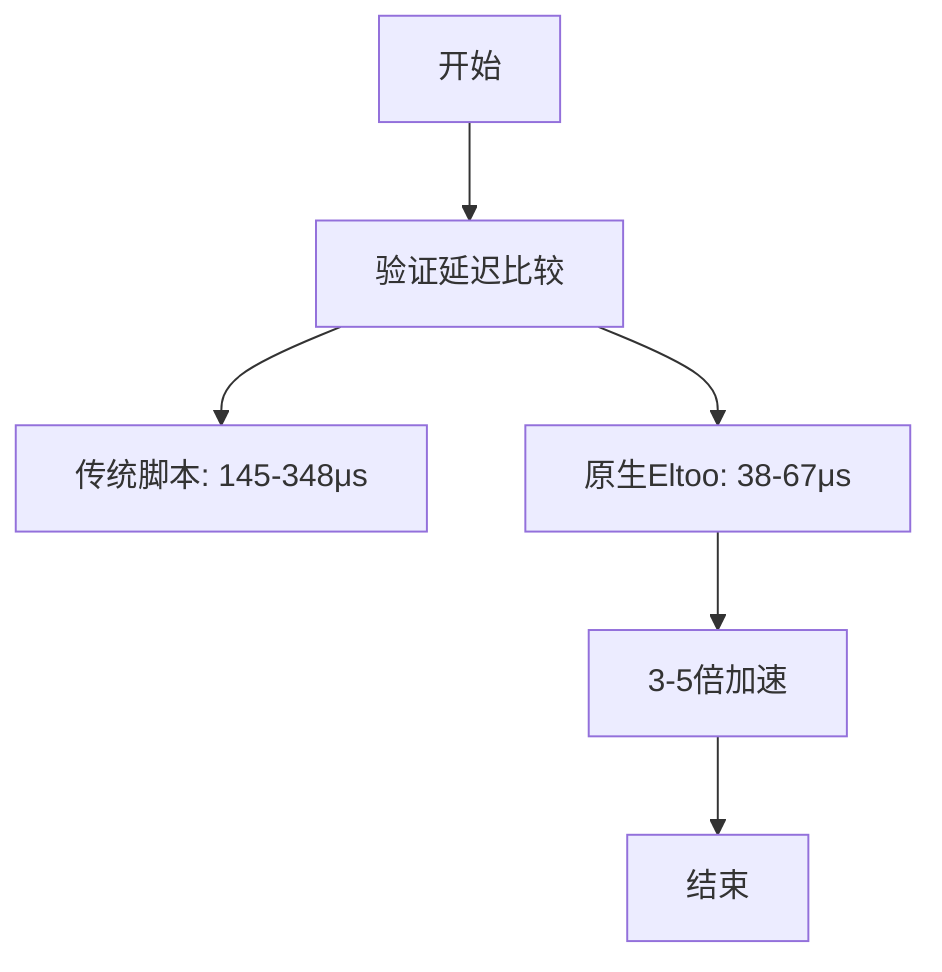

# 技术架构

<cite>
**本文档引用文件**   
- [paper.aux](file://paper.aux)
- [paper.toc](file://paper.toc)
- [sections/implementation.tex](file://sections/implementation.tex)
- [sections/registry_free.tex](file://sections/registry_free.tex)
- [sections/safety_analysis.tex](file://sections/safety_analysis.tex)
- [sections/evaluation.tex](file://sections/evaluation.tex)
- [sections/privacy.tex](file://sections/privacy.tex)
- [sections/topological_primitives.tex](file://sections/topological_primitives.tex)
</cite>

## 目录
1. [引言](#引言)
2. [分层架构设计](#分层架构设计)
3. [双轨状态机](#双轨状态机)
4. [注册表无关架构](#注册表无关架构)
5. [GhostDAG共识嵌入与O(1)验证](#ghostdag共识嵌入与o1验证)
6. [系统上下文与组件交互](#系统上下文与组件交互)
7. [安全与性能分析](#安全与性能分析)

## 引言

本文档深入描述基于UTXO的支付通道系统分层架构设计，重点阐述理论框架层、共识层、状态机与UTXO索引层、密码学原语层之间的关系与数据流。详细说明双轨状态机如何分离静态资金能力与动态状态演进，以及该设计带来的安全性与效率提升。解释注册表无关架构如何通过UTXO到状态的投影函数Φ实现自我主权通道发现。结合paper.aux所支持的交叉引用信息，还原论文中关于GhostDAG共识嵌入、O(1)模式匹配验证机制的实现逻辑。提供系统上下文图与组件交互说明，帮助开发者理解各模块间的依赖与协作方式。

## 分层架构设计

该支付通道系统采用分层架构设计，确保关注点分离。系统分为共识层、UTXO层、协议层和应用层。

**图示来源**
- [sections/implementation.tex](file://sections/implementation.tex#L5-L22)

**本节来源**
- [sections/implementation.tex](file://sections/implementation.tex#L5-L22)

## 双轨状态机

双轨状态机设计将静态资金能力与动态状态演进分离，通过两个独立的UTXO实现：Fund UTXO代表静态资金能力，State UTXO代表动态状态演进。

**图示来源**
- [sections/implementation.tex](file://sections/implementation.tex#L24-L70)

**本节来源**
- [sections/implementation.tex](file://sections/implementation.tex#L67-L70)

## 注册表无关架构

系统实现注册表无关机制，通道通过解析UTXO集发现。发现函数Φ作为透镜，将原始区块链数据过滤为逻辑通道视图，无需外部注册表。

**图示来源**
- [sections/registry_free.tex](file://sections/registry_free.tex#L24-L65)

**本节来源**
- [sections/registry_free.tex](file://sections/registry_free.tex#L1-L65)

## GhostDAG共识嵌入与O(1)验证

共识层通过GhostDAG权重解决并发拼接冲突，确保线性一致性。验证机制采用O(1)模式匹配，消除脚本VM开销，实现3-5倍速度提升。

**图示来源**
- [sections/safety_analysis.tex](file://sections/safety_analysis.tex#L161-L193)

**本节来源**
- [sections/evaluation.tex](file://sections/evaluation.tex#L13-L45)

## 系统上下文与组件交互

系统组件通过明确的接口交互。共识验证器执行状态单调性检查，状态机处理本地状态演进，UTXO索引器支持注册表无关发现。

**本节来源**
- [sections/implementation.tex](file://sections/implementation.tex#L72-L137)

## 安全与性能分析

系统在安全性和性能方面均有显著提升。存储复杂度从O(N)降至O(1)，减少99.87%存储开销。STPC策略将DoS攻击成本从O(1)提升至Ω(N)。

**图示来源**
- [sections/evaluation.tex](file://sections/evaluation.tex#L13-L45)

**本节来源**
- [sections/evaluation.tex](file://sections/evaluation.tex#L1-L179)
- [sections/safety_analysis.tex](file://sections/safety_analysis.tex#L32-L103)