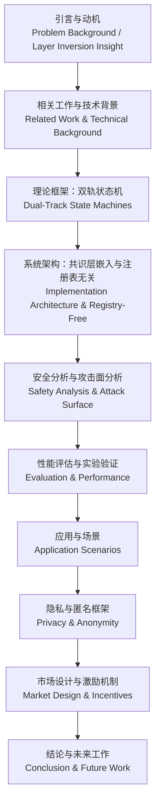
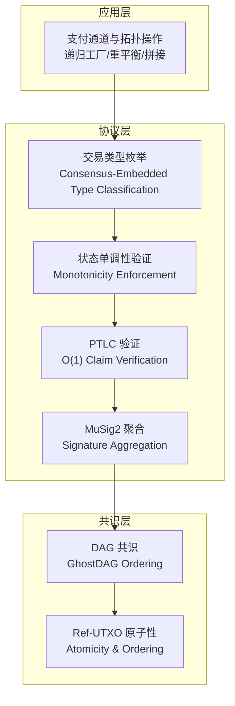
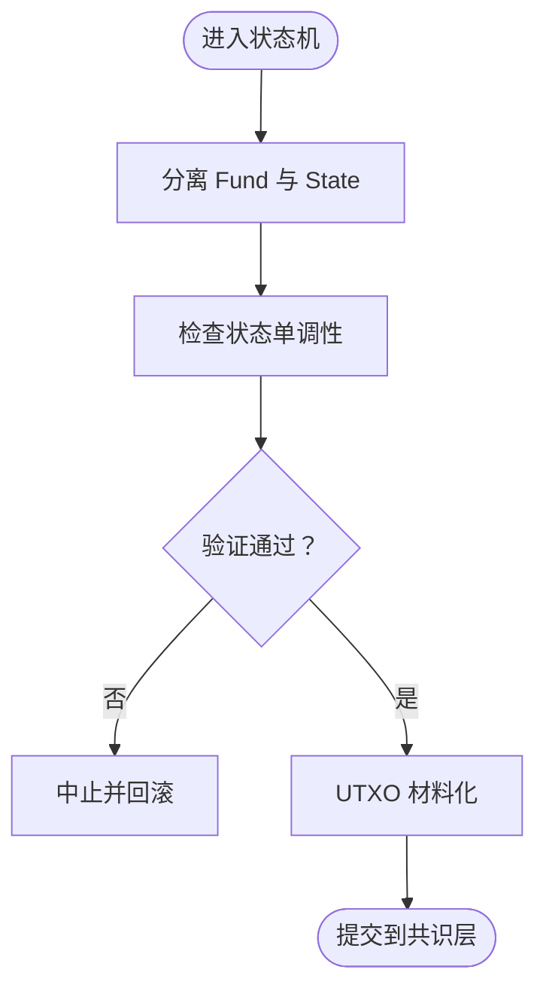
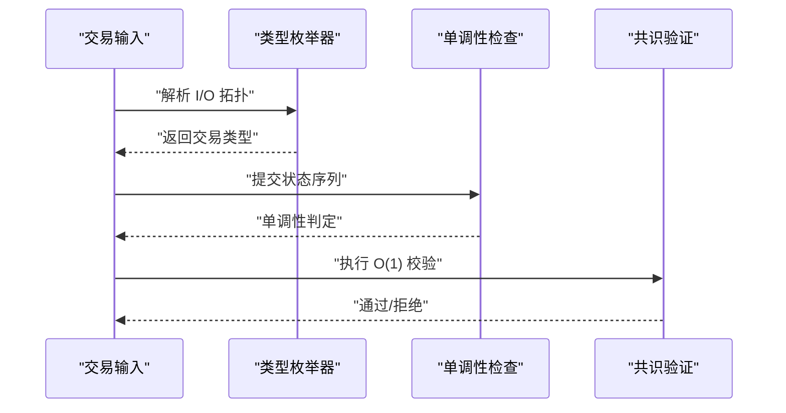
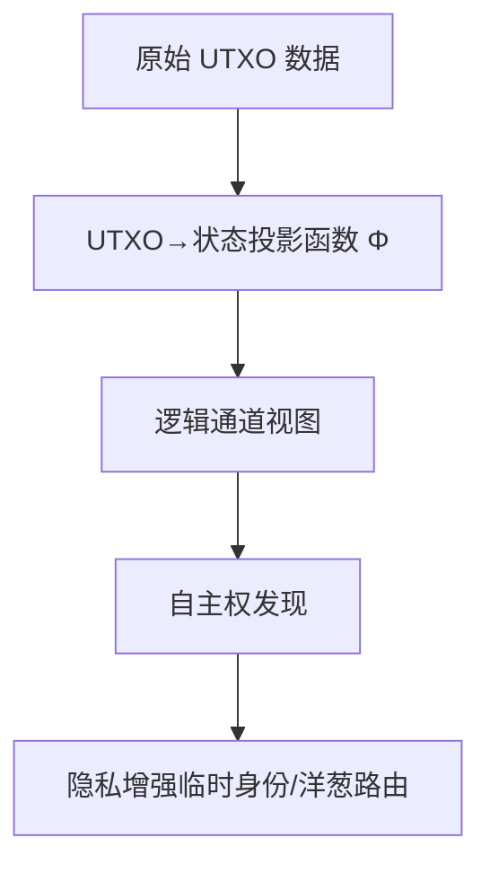
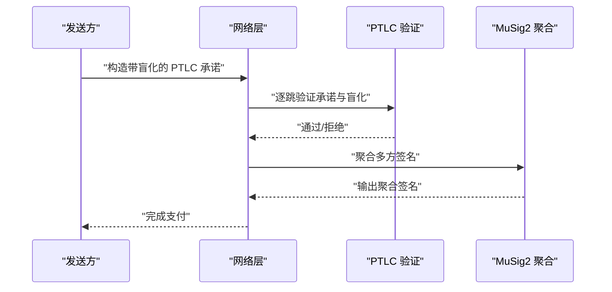
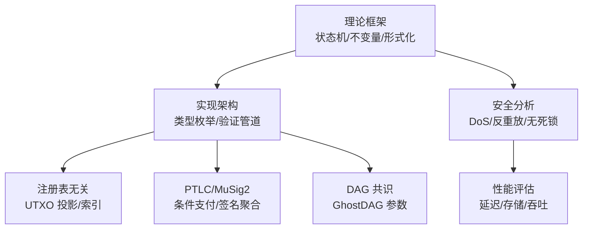

# 项目介绍

<cite>
**本文引用的文件**
- [paper.aux](file://paper.aux)
- [paper.toc](file://paper.toc)
- [paper.tex](file://paper.tex)
- [sections/related_work.tex](file://sections/related_work.tex)
- [sections/theoretical_framework.tex](file://sections/theoretical_framework.tex)
- [sections/registry_free.tex](file://sections/registry_free.tex)
- [sections/implementation.tex](file://sections/implementation.tex)
- [sections/safety_analysis.tex](file://sections/safety_analysis.tex)
- [sections/evaluation.tex](file://sections/evaluation.tex)
- [sections/conclusion.tex](file://sections/conclusion.tex)
- [sections/appendix.tex](file://sections/appendix.tex)
</cite>

## 目录
1. [引言](#引言)
2. [项目结构](#项目结构)
3. [核心组件](#核心组件)
4. [架构总览](#架构总览)
5. [详细组件分析](#详细组件分析)
6. [依赖关系分析](#依赖关系分析)
7. [性能考量](#性能考量)
8. [故障排查指南](#故障排查指南)
9. [结论](#结论)
10. [附录](#附录)

## 引言
本研究面向区块链支付通道在可扩展性、安全性与隐私保护方面的结构性缺陷，提出一种基于 UTXO 原生语义的双轨状态机架构与注册表无关（Registry-Free）设计。其核心目标是通过共识层嵌入的类型枚举与状态单调性约束，将验证复杂度从随脚本规模线性增长降低到常数级，同时借助 DAG 共识（如 GhostDAG）实现亚秒级结算与高吞吐状态检查点，从而在不依赖外部注册表的前提下完成自主权发现与隐私增强。该方案还引入 PTLC 等密码学原语，以实现多跳支付的盲化与原子性，兼顾安全与效率。

本项目面向三类读者：
- 区块链研究人员：关注形式化方法、状态机建模与协议安全证明；
- 协议开发者：关注共识层嵌入式验证、交易拓扑与实现复杂度；
- 密码学工程师：关注 PTLC、MuSig2 等原语的组合与部署策略。

## 项目结构
论文采用“章节化”组织方式，围绕以下主线展开：问题背景与动机、相关工作与技术背景、理论框架（双轨状态机）、系统架构（共识层嵌入、注册表无关）、安全分析与性能评估、应用与市场设计、结论与未来方向。目录与辅助文件（.aux/.toc）清晰标注了各节主题与子节层级，便于快速导航。

**图表来源**
- [paper.toc](file://paper.toc#L1-L175)

**章节来源**
- [paper.toc](file://paper.toc#L1-L175)
- [paper.aux](file://paper.aux#L1-L120)

## 核心组件
- 双轨状态机：将静态资金锚定与动态状态演进分离，形成 Fund 与 State 的耦合不变量，确保状态单调性与可恢复性。
- 共识层嵌入式验证：通过交易类型枚举与拓扑模式匹配，实现 O(1) 复杂度的分类与校验。
- 注册表无关架构：利用 UTXO 到状态投影函数进行自主权发现，无需全局注册表。
- PTLC 与 MuSig2：在支付层实现多跳盲化与签名聚合，在网络层支持洋葱路由与隐身地址。
- DAG 共识兼容：与 GhostDAG 等 DAG 共识协同，提供亚秒级确认与高吞吐状态检查点。

**章节来源**
- [paper.tex](file://paper.tex#L162-L174)
- [sections/theoretical_framework.tex](file://sections/theoretical_framework.tex#L1-L60)
- [sections/registry_free.tex](file://sections/registry_free.tex#L1-L40)
- [sections/related_work.tex](file://sections/related_work.tex#L317-L325)

## 架构总览
下图展示了 Native Eltoo 的整体架构：上层为支付通道与拓扑重组操作，中层为共识层嵌入的交易类型枚举与验证管道，底层为 DAG 共识与 Ref-UTXO 原子性保障。

**图表来源**
- [paper.tex](file://paper.tex#L168-L172)
- [sections/registry_free.tex](file://sections/registry_free.tex#L100-L160)
- [sections/implementation.tex](file://sections/implementation.tex#L120-L140)
- [sections/related_work.tex](file://sections/related_work.tex#L317-L325)

## 详细组件分析

### 双轨状态机与 UTXO 材料化层
- 组件职责
  - 将资金锚定（Fund）与状态（State）解耦，保证状态单调性与可回溯性；
  - 通过材料化层将抽象状态映射到 UTXO 结构，支撑 O(1) 验证与拓扑复用。
- 关键不变量
  - 状态-资金耦合不变量：确保状态演进不破坏资金完整性；
  - 单调性定理：在共识规则下，状态序列严格单调，防止回滚与重放。
- 形式化基础
  - 使用有限状态机（DFA）建模，结合 TLA+ 进行安全性质数理验证。

**图表来源**
- [sections/theoretical_framework.tex](file://sections/theoretical_framework.tex#L1-L60)
- [sections/theoretical_framework.tex](file://sections/theoretical_framework.tex#L579-L620)

**章节来源**
- [sections/theoretical_framework.tex](file://sections/theoretical_framework.tex#L1-L60)
- [sections/theoretical_framework.tex](file://sections/theoretical_framework.tex#L579-L620)

### 共识层嵌入式验证与交易类型枚举
- 设计要点
  - 在共识层以代数数据类型定义交易类型，通过 O(1) 拓扑模式匹配完成分类；
  - 将状态单调性与类型约束内嵌于共识规则，避免脚本 VM 开销。
- 性能收益
  - 验证因果图显示，传统 Lightning 需要处理历史依赖，而 Native Eltoo 仅需对最新状态与静态资金锚点进行验证。

**图表来源**
- [paper.tex](file://paper.tex#L168-L172)
- [sections/registry_free.tex](file://sections/registry_free.tex#L100-L160)

**章节来源**
- [paper.tex](file://paper.tex#L168-L172)
- [paper.aux](file://paper.aux#L56-L60)

### 注册表无关架构与自主权发现
- 价值主张
  - 通过 UTXO 到状态投影函数实现自主权发现，无需外部注册表；
  - 结合临时身份与洋葱路由，提升隐私与抗审查能力。
- 实现路径
  - 轻量索引器支持 O(1) 快速查找；
  - PTLC 验证保持 O(1) 复杂度，降低隐私泄露风险。

**图表来源**
- [sections/registry_free.tex](file://sections/registry_free.tex#L1-L40)
- [sections/registry_free.tex](file://sections/registry_free.tex#L100-L160)

**章节来源**
- [sections/registry_free.tex](file://sections/registry_free.tex#L1-L40)
- [sections/registry_free.tex](file://sections/registry_free.tex#L100-L160)

### PTLC 与 MuSig2：条件支付与签名聚合
- PTLC
  - 多跳盲化对比：每跳对锁进行同态加法盲化，避免全局哈希暴露；
  - 原子性与无死锁：形式化证明保障多跳支付的原子性与可达性。
- MuSig2
  - 聚合签名以降低通信复杂度与签名体积；
  - 域分离与 PSTT 包装确保上下文隔离与跨实现兼容。

**图表来源**
- [sections/theoretical_framework.tex](file://sections/theoretical_framework.tex#L791-L820)
- [sections/implementation.tex](file://sections/implementation.tex#L1-L60)

**章节来源**
- [sections/theoretical_framework.tex](file://sections/theoretical_framework.tex#L791-L820)
- [sections/implementation.tex](file://sections/implementation.tex#L1-L60)

### DAG 共识兼容与 Ref-UTXO 原子性
- 共识兼容
  - 选择 GhostDAG 是架构驱动：并发块贡献共识，提供亚秒级确认与更高吞吐；
  - 通过难度调整算法得分构建全局单调时钟，适合作为相对时间锁基准。
- Ref-UTXO 原子性
  - 通过引用语义与拓扑消费关系，确保状态检查点的原子性与顺序一致性。

**图表来源**
- [sections/related_work.tex](file://sections/related_work.tex#L317-L325)
- [sections/appendix.tex](file://sections/appendix.tex#L104-L116)

**章节来源**
- [sections/related_work.tex](file://sections/related_work.tex#L317-L325)
- [sections/appendix.tex](file://sections/appendix.tex#L104-L116)

## 依赖关系分析
- 组件耦合
  - 理论框架（状态机与不变量）为系统架构提供形式化基础；
  - 共识层嵌入式验证依赖交易类型枚举与单调性规则；
  - 注册表无关架构依赖 UTXO 投影与索引器；
  - PTLC 与 MuSig2 作为密码学原语被支付层与网络层复用。
- 外部依赖
  - DAG 共识（如 GhostDAG）与相关参数（k、D）影响确认速度与安全深度；
  - 形式化工具链（TLA+、Coq）用于安全性质数理验证。

**图表来源**
- [sections/theoretical_framework.tex](file://sections/theoretical_framework.tex#L1-L60)
- [sections/implementation.tex](file://sections/implementation.tex#L120-L140)
- [sections/registry_free.tex](file://sections/registry_free.tex#L100-L160)
- [sections/related_work.tex](file://sections/related_work.tex#L317-L325)

**章节来源**
- [sections/theoretical_framework.tex](file://sections/theoretical_framework.tex#L1-L60)
- [sections/implementation.tex](file://sections/implementation.tex#L120-L140)
- [sections/registry_free.tex](file://sections/registry_free.tex#L100-L160)
- [sections/related_work.tex](file://sections/related_work.tex#L317-L325)

## 性能考量
- 验证复杂度
  - 传统方案：随脚本规模线性增长；
  - Native Eltoo：通过共识层类型枚举与拓扑匹配，达到 O(1)。
- 结算延迟
  - 采用 GhostDAG 共识，亚秒级确认；在等效时间窗内，确认数量与安全性优于线性链。
- 存储与通信
  - 状态存储成本与通信复杂度在文中给出对比表格，便于工程选型。

**章节来源**
- [paper.tex](file://paper.tex#L168-L172)
- [sections/evaluation.tex](file://sections/evaluation.tex#L1-L40)
- [sections/evaluation.tex](file://sections/evaluation.tex#L170-L180)

## 故障排查指南
- DoS 攻击与替换策略
  - STPC（单提示每通道）策略有效限制内存池 DoS 暴露，使攻击成本与状态序列呈线性关系。
- 状态回滚与重放
  - 通过状态单调性与类型约束，结合共识规则，消除回滚与跨通道重放风险。
- 拼接冲突与拓扑重构
  - 并发拼接通过 GhostDAG 权重进行冲突化解，保证一致性与无死锁。

**章节来源**
- [sections/safety_analysis.tex](file://sections/safety_analysis.tex#L1-L60)
- [sections/evaluation.tex](file://sections/evaluation.tex#L170-L180)
- [sections/theoretical_framework.tex](file://sections/theoretical_framework.tex#L579-L620)

## 结论
本研究提出了基于 UTXO 原生语义的双轨状态机与注册表无关架构，通过共识层嵌入的类型枚举与状态单调性，将验证复杂度降至 O(1)，并结合 DAG 共识实现亚秒级结算与高吞吐状态检查点。形式化方法（TLA+、Coq）贯穿理论与实现，覆盖隔离、反重放、无死锁等关键安全性质。面向 DeFi、微支付流、DEX、游戏经济、物联网微交易、CDN 激励与供应链金融等场景，Native Eltoo 提供可扩展、安全且隐私友好的支付通道基础设施。

**章节来源**
- [sections/conclusion.tex](file://sections/conclusion.tex#L1-L120)

## 附录
- 基础概念指引（面向初学者）
  - UTXO 模型与交易结构：理解价值单元与输入输出关系；
  - 支付通道原理：资金锚定、状态更新与撤销机制；
  - 条件支付原语：HTLC 与 PTLC 的演化与差异；
  - 时间锁机制：相对/绝对时间锁在通道中的作用；
  - DAG 共识：GhostDAG 的并发块与确认特性；
  - 有限状态机：形式化建模与验证方法。
- 专家导航
  - 理论框架：双轨状态机、不变量与形式化证明；
  - 实现架构：共识层类型枚举、验证管道与索引器；
  - 安全分析：隔离定理、反重放、DoS 成本边界、无死锁；
  - 性能评估：延迟、存储与吞吐对比；
  - 应用场景：DeFi 流动性网格、微支付流、DEX、游戏经济、IoT 微交易、CDN 激励、供应链金融。

**章节来源**
- [sections/appendix.tex](file://sections/appendix.tex#L104-L116)
- [sections/theoretical_framework.tex](file://sections/theoretical_framework.tex#L1-L60)
- [sections/implementation.tex](file://sections/implementation.tex#L120-L140)
- [sections/safety_analysis.tex](file://sections/safety_analysis.tex#L1-L60)
- [sections/evaluation.tex](file://sections/evaluation.tex#L1-L40)